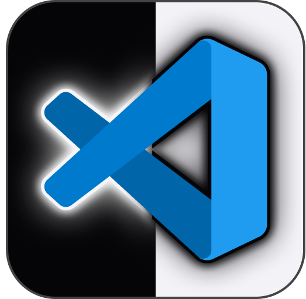
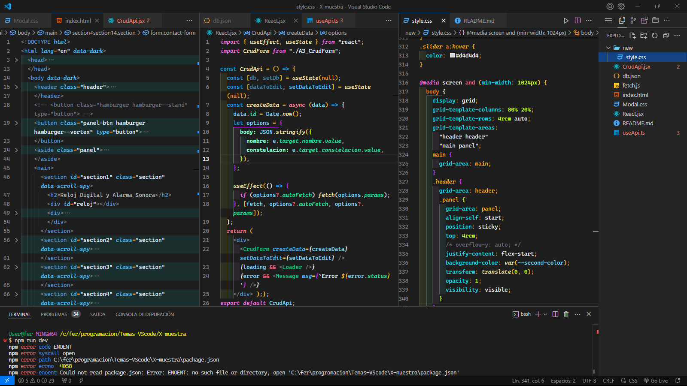
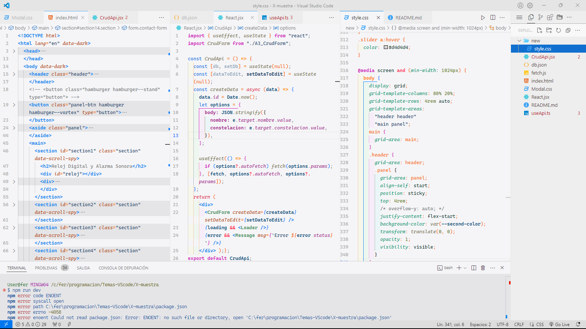

#  **Theme Italic Fs**

**Theme Italic Fs** is an enhanced theme for Visual Studio Code, specifically designed for **JavaScript** developers, with support for **Cascadia Code** and italic styling.

## Key Features

- **Optimized for JavaScript**
  - Reserved keywords in italics.
  - Distinct colors for better visual differentiation.
- **Contrast balance**: carefully designed color scheme.

[](https://marketplace.visualstudio.com/items?itemName=cod-fs.borrador-tema-dark)
[](https://marketplace.visualstudio.com/items?itemName=cod-fs.borrador-tema-dark)

---

⭐ **If you like this theme, don’t forget to leave a star and a comment.**

---

## Screenshots

### Fs Dark++



### Fs Light++



---

## ⚠️ Important Notes

1. **Reapplying CSS rules after updates:**

   - Each major VSCode update will require you to re-add the CSS rules in `workbench.desktop.main.css`.

2. **Corrupt installation warning:**
   - When making the first change to `workbench.desktop.main.css`, a warning message will appear. Click the gear icon and select "Ignore message."

---

## [+]Option: Installation Guide

### Add Support for **Cascadia Code**

#### 1. Download and Install Cascadia Code

- Download [Cascadia Code](https://github.com/microsoft/cascadia-code) (free).
- Copy the fonts into your operating system’s fonts folder.

#### 2. Configure Visual Studio Code

- Open user settings (`Ctrl + ,`) and add the following options:

```json
{
  "workbench.colorTheme": "Fs Dark++",
  "editor.fontFamily": "Cascadia Code",
  "terminal.integrated.fontFamily": "Cascadia Code"
}
```

#### 3. Enable Italics

```json
{
  "editor.fontLigatures": "'calt', 'ss01'"
}
```

#### 4. Customize Bracket Colors

```json
{
  "workbench.colorCustomizations": {
    "[Fs Dark++]": {
      "editorBracketHighlight.foreground1": "#ffc020",
      "editorBracketHighlight.foreground2": "#f5f5f7",
      "editorBracketHighlight.foreground3": "#d92eff",
      "editorBracketHighlight.foreground4": "#c6fb20"
    },
    "[Fs Light++]": {
      "editorBracketHighlight.foreground1": "#f56900",
      "editorBracketHighlight.foreground2": "#007aff",
      "editorBracketHighlight.foreground3": "#d416bf",
      "editorBracketHighlight.foreground4": "#1d1d1d"
    }
  }
}
```

---

## Enjoy the Theme! 
